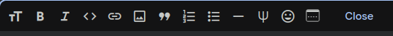

## ¿Qué son las celdas?

-   Las celdas son la base de un notebook.
    -   Son los bloques donde escribimos contenido\
    -   Permiten organizar el código y la documentación\
    -   Representan la estructura modular del notebook


## Importancia de las celdas

-   Las celdas permiten:
    -   Dividir el código en secciones\
    -   Organizar el flujo de trabajo\
    -   Facilitar la colaboración\
    -   Mejorar la documentación


## Tipos de celdas

-   Existen tres tipos principales:
    -   Celda de código
    -   Celda de texto
    -   Celda Markdown

## Celda de código

-   Su propósito es:
    -   Escribir y ejecutar código Python\
    -   Mostrar resultados inmediatamente
-   Puede verse como una **calculadora interactiva**.

## Celda de código

-   Ejemplo:

```{python}
#| echo: true
print("Hola Mundo")
```

## Celda de texto

-   Se usa para:
    -   Documentar el código
    -   Explicar qué hace cada bloque
    -   Agregar comentarios para otros usuarios
-   Es similar a agregar notas adhesivas al código.

## Celda Markdown

-   Es un tipo especial de celda de texto que permite formato.

-   Permite:

-   Negritas

-   Cursivas

-   Listas

-   Hipervínculos

-   Código formateado

## Celda Markdown

-   Ejemplo:

\*\*Texto en negrita\*\*

\*Texto en cursiva\*

\[Enlace a Google\](https://www.google.com/)


## Celda Markdown

Mencionar que se puede usar el siguiente menú para escribir código Markdown.

{fig-align="center" width="80%"}

## Explorando celdas en Colab

- En un notebook podemos observar múltiples celdas.

- Cada una representa una unidad modular de contenido.


## Beneficios de la estructura por celdas

- Las celdas permiten:
  - Organización clara del código
  - Mejor lectura y comprensión
  - Documentación efectiva
  - Trabajo colaborativo
  
## Práctica

- Replicar el contenido del jupyter notebook: 
  - codigo002.ipynb 
- Usar la opción Table of Contents del menú View para poner los encabezados
  de primer nivel. 
  