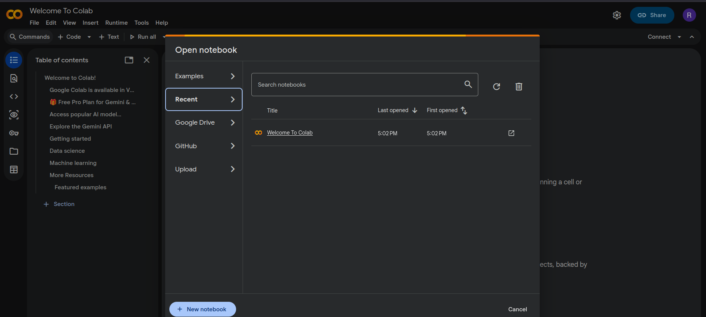

# Creación de una cuenta en Google Colab

- En esta sección veremos cómo configurar una cuenta en Google Colab.

---

# Paso 1: Crear una cuenta de Google

- Lo primero que necesitas es una cuenta de Google.

  - Si ya tienes una cuenta, puedes usarla.
  - Si no tienes una cuenta, debes crear una en:
  - https://accounts.google.com/

- En la mayoría de los casos, ya tendrás una cuenta de Google.

---

# Paso 2: Acceder a Google Colab

- Una vez que tengas tu cuenta de Google, debes acceder a Google Colab.

- Puedes hacerlo mediante el siguiente enlace:

  - https://colab.research.google.com/

- Si el sistema lo solicita, inicia sesión con tu cuenta de Google.

---

# ¿Cómo iniciar sesión en Google Colab?

1. Abre tu navegador.
2. Escribe la dirección completa:
  - colab.research.google.com
  - o simplemente escribe "Google Colab" en el buscador.
3. Presiona Enter.
4. Haz clic en el primer resultado que diga:
  - colab.research.google.com

---

# Inicio de sesión

- Si ya has iniciado sesión previamente, se abrirá automáticamente.
- Si no has iniciado sesión, el sistema te pedirá:
  - Tu correo electrónico
  - Tu contraseña de Google

- Después de ingresar tus credenciales, se abrirá la pantalla principal.

---

# Pantalla inicial de Google Colab

- Cuando abres Google Colab por primera vez, verás:

  - La pantalla principal del entorno
  - Un notebook predeterminado (archivo de ejemplo)
  - Opciones para crear un nuevo notebook

- El notebook predeterminado está disponible para ayudarte a comenzar.

---

# Pantalla inicial de Google Colab

{fig-align="center" width="80%"}

# Resultado

- Una vez completados estos pasos, ya deberías poder:
  - Acceder a Google Colab
  - Crear nuevos notebooks
  - Comenzar a escribir y ejecutar código Python

---
